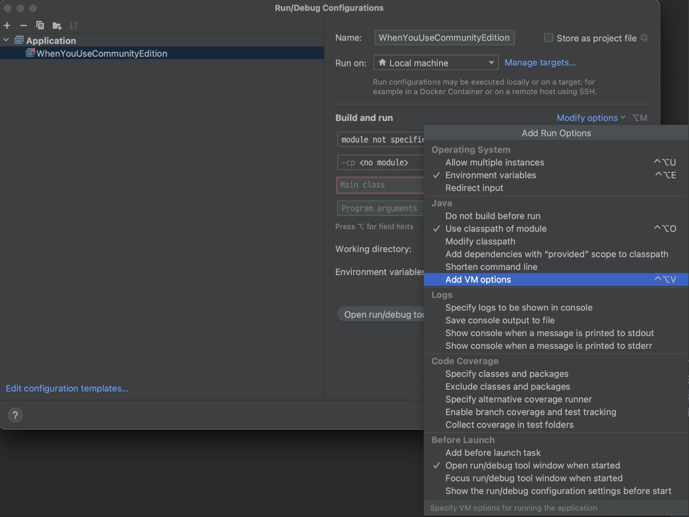

# CORS Configuration for Spring WebMVC

## Prerequisites

- JDK 16+

## Properties File

See example:

```yaml
# https://github.com/merge-simpson/webmvc-cors-config-core
app:
  cors:
    max-age: 1800 # [sec]
    exposed-headers: "*" # or list
    log-level: info
    allows-credentials: true
    allowed:
      methods: "*" # or list
      headers: "*" # or list
      origins:
        - https://your-domain.com
        - https://sub.your-domain.com
```

### Log Level

- ALL (same to TRACE)
- TRACE (same to ALL)
- DEBUG
- INFO
- WARN
- ERROR
- OFF

Log message (example):

```text
2024-01-01T00:00:00.000+00:00 DEBUG 9999 --- [your-service-application] [  restartedMain] e.c.p.t.LogLevel                       : CORS 설정

Allows Credentials: true

Exposed Headers:
- *


Allowed Headers:
- *


Allowed Methods:
- *


Allowed Origins:
- http://localhost:3000
- https://localhost:3000
- https://127.0.0.1:3000


Max Age(at Browser): 1800 [sec]
```

# Apply with Custom File

You can apply it with the custom files.
If their directories and file names are `resources/app/cors/cors.yml`
or `resources/app/cors/cors-{profile}.yml`,
you can import them to `application.yml` or `application.properties`.

```yaml
# application.yml
spring:
  config:
    import:
      - app/cors/cors.yml
      # same to "classpath:/app/cors.cors.yml"
```

## Active Profile Supported

Just import `cors.yml`, then other files with profiles will be imported when the profile is included to active profiles.

- `cors.yml`
- `cors-dev.yml` (when active profiles include "dev" profile.)
- `cors-local.yml` (when active profiles include "local" profile.)
- `cors-{profile}.yml` (`{profile}` should be substituted with your custom text.)

(Prerequisite: The files should be in the same directory.)

You may know the way how to set active profiles. If you are using intellij ultimate edition,
you can config the run/debug configurations.
Or you can insert the active profiles to VM arguments.  

Example:

When running with the "local" active profile.

```shell
java ... -Dspring.profiles.active=local ...
```

Intellij community allows you to insert them to VM options.

```text
-Dspring.profiles.active=local
```

